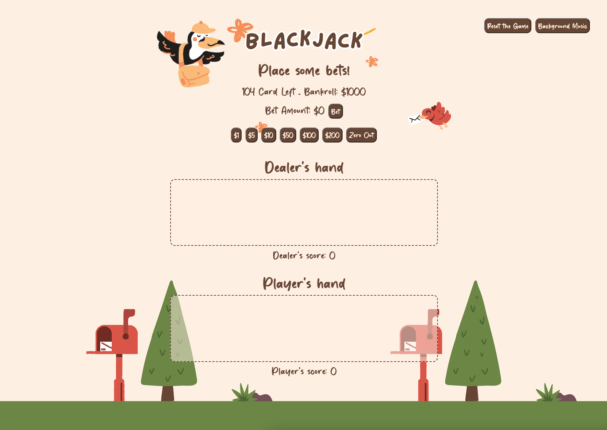
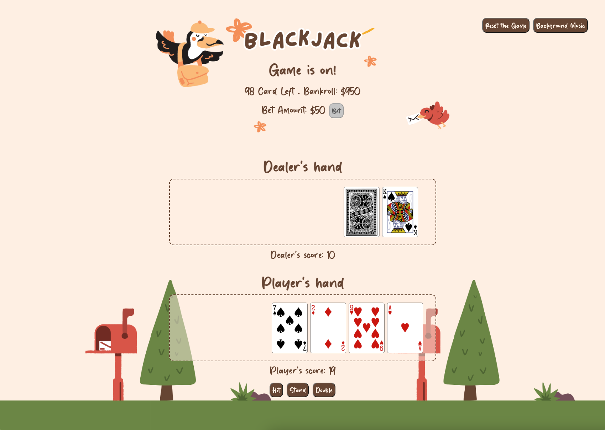
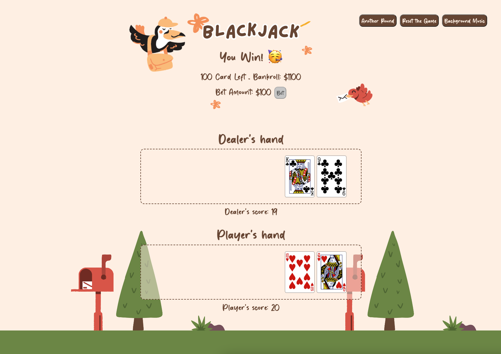
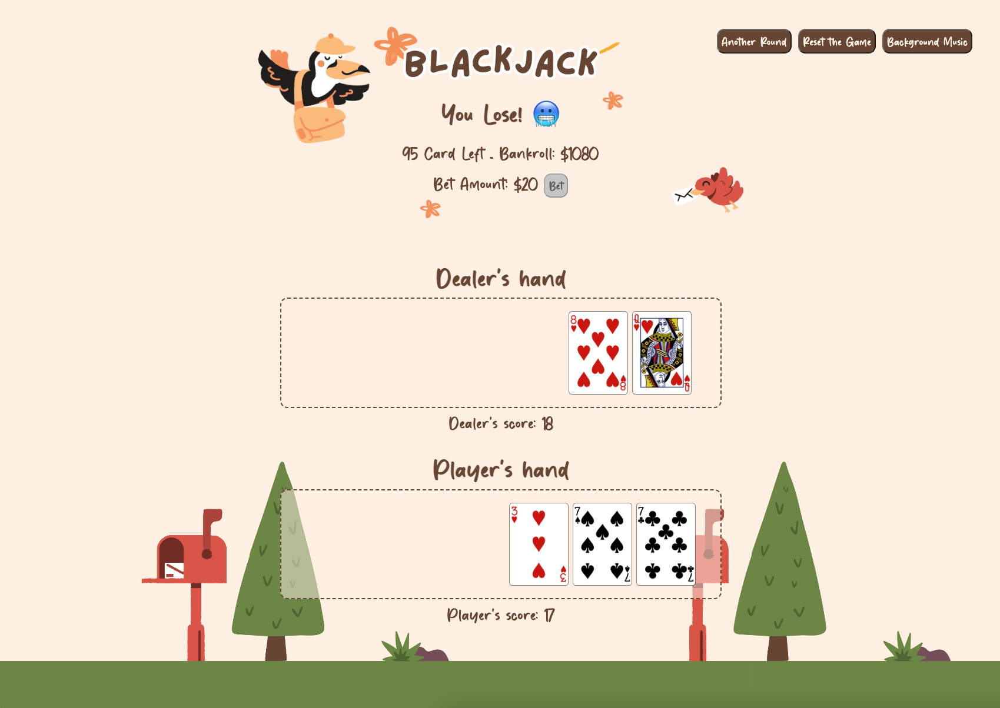

# Blackjack
Blackjack is a famous card game found in many casinos. It's a game where players try to get cards that add up to 21 without going over. In this version, you play against the computer, and we use two sets of cards.

# Screenshot

# Technologies Used
- Javascript
- HTML
- CSS

# Getting Started
Hey there! Welcome to my GitHub repository.

Ready to play some blackjack? [Let's get started!](https://amandayclee.github.io/blackjack/)

Here's how it works:

1. You'll begin with $1000 in your bankroll. Place a bet to receive your first two cards.
2. If you're dealt a soft hand (where one of your cards is an Ace), your options are stand or hit. For a hard hand (no Ace or Ace counted as 1), you have an additional choice - double your bet! But remember, if you double down, you can only hit one more time.
3. Once your hand is complete, the game determines the winner:
- Blackjack: Win your bet plus double the winnings.
- Win: Get back your bet plus your winnings.
- Lose: Say goodbye to your bet.
4. If you run out of chips or cards, simply reset the game and start again.

# Next Steps
Planned future enhancements:
- [ ] implement `split` feature
- [ ] implement `insurance` feature
- [ ] implement `surrender` feature 
- [ ] provide `deckSize` option
- [ ] add `rule` explanation
- [ ] add `cardCounting` feature
